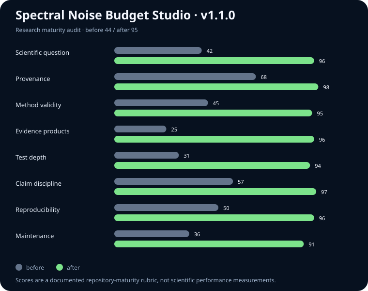

# Spectral Noise Budget Studio

A provenance-bound, pre-ETC audit of four molecular wavelength markers against four JWST/NIRCam system-throughput profiles.

[](https://github.com/Biswajit1999/spectral-noise-budget-studio/actions/workflows/ci.yml)
[](https://github.com/Biswajit1999/spectral-noise-budget-studio/releases)
[](LICENSE)

**[Open the interactive evidence board →](https://biswajit1999.github.io/spectral-noise-budget-studio/)**



## Result first

The v1.1.0 controlled audit evaluates 16 declared feature/filter pairs using linear interpolation over 3,192 committed samples.

| Classification | Count | Decision rule |
|---|---:|---|
| Core | 4 | `T(λ) / Tpeak ≥ 0.5` |
| Wing | 0 | `0.1 ≤ T(λ) / Tpeak < 0.5` |
| Edge | 1 | `0 < T(λ) / Tpeak < 0.1` |
| Outside | 11 | outside sampled support or zero response |

The non-obvious result is the CH₄ marker at 3.30 μm in F277W: it lies just inside the sampled profile but retains only about 0.026% of peak response. Under the deliberately narrow source-photon-limited proxy, matching the peak-response photon count would require about 3,805 times longer. The same marker is a core placement in F356W.

## Research question and hypothesis

**Question:** At four declared molecular feature wavelengths, which committed NIRCam profiles retain at least half of peak response?

**Hypothesis:** Each marker has at least one core placement, while apparent overlap at a filter edge can have a severe photon-limited cost.

The hypothesis is supported for this exact four-by-four matrix. It is not generalized to other molecular bands, observing modes, targets, detector configurations, or source spectra.

## Scientific boundary

This is a passband-placement audit, not a JWST detectability forecast. The filter curves support a necessary optical-coverage check. They do not by themselves model background, detector readout, extraction aperture, saturation, source morphology, covariance, systematics, or scheduling overheads. A broadband imaging filter also does not isolate a monochromatic molecular feature.

Use the official [JWST Pandeia throughput workflow](https://jwst-docs.stsci.edu/jwst-exposure-time-calculator-overview/jwst-etc-pandeia-engine-tutorial/jwst-etc-instrument-throughputs) and ETC for an observing proposal. STScI describes the NIRCam curves as total system throughput, including the telescope, NIRCam optics, filters, dichroics, and detector response; see the [NIRCam filter documentation](https://jwst-docs.stsci.edu/jwst-near-infrared-camera/nircam-instrumentation/nircam-filters).

## Methods in one screen

For a marker wavelength `λ`, linear interpolation gives `T(λ)` from the bracketing profile samples. The normalized response and proxy are

```text
q(λ) = T(λ) / Tpeak
photon-limited relative-time proxy = Tpeak / T(λ) = 1 / q(λ)
```

The proxy follows only from photon count being proportional to throughput × time. It is infinite at zero response and deliberately excludes every other noise term.

The pivot wavelength is calculated from the sampled curve:

```text
λpivot = sqrt[ ∫ T(λ) λ dλ / ∫ T(λ)/λ dλ ]
```

All integrals use the trapezoidal rule. See [docs/METHODS.md](docs/METHODS.md) for the complete protocol, assumptions, falsifiers, and validation plan.

## Reproduce the reviewed evidence

Requires Node.js 24.

```bash
npm ci
npm run evidence:check
npm test
npm run build
```

To rebuild the deterministic derived products from the committed source snapshot:

```bash
npm run evidence
```

To refresh the external source snapshot explicitly:

```bash
python -m pip install -r requirements-data.txt
python scripts/build_jwst_filters.py
npm run evidence
npm run check
```

External refresh is intentionally separate from ordinary build and deployment. A remote service change cannot silently alter a reviewed release.

## Evidence products

| Artifact | Purpose |
|---|---|
| `public/data/jwst-nircam-filters.json` | reviewed source snapshot, URLs, sample arrays, retrieval time, SHA-256 receipts |
| `public/data/feature-passband-audit.json` | machine-readable question, hypothesis, rules, summaries, and all 16 results |
| `research/feature-passband-audit.csv` | analysis-ready result table |
| `assets/research-maturity-before-after.svg` | before/after repository-maturity audit |
| `research/report-source.md` | compact result narrative and claim ledger |
| `docs/BASELINE_AUDIT.md` | scored before/after rubric with evidence |

## Verification depth

The test suite covers:

- array length, finite-value, bounds, ordering, and SHA-256 contracts;
- recomputation of each stored curve peak;
- exact-knot, outside-support, and midpoint interpolation behavior;
- finite pivot wavelength and equivalent width for every filter;
- the preregistered four-core/one-edge outcome;
- the reciprocal identity between normalized response and the time proxy;
- staleness checks for every generated evidence product.

CI uses Node 24, immutable action commits, minimum permissions, concurrency cancellation, and a ten-minute timeout. Deployment runs the same full verification gate.

## Source provenance

The four VOTables are retrieved from the [SVO Filter Profile Service](https://svo2.cab.inta-csic.es/theory/fps/). Each source URL and payload SHA-256 is retained beside the samples. SVO documents its query interface and IVOA-compatible transmission-curve representation in the [service note](https://svo2.cab.inta-csic.es/theory/NOTE-SVOFPS-1.0.20121015.pdf).

## Repository map

```text
src/passband.ts                    analysis core
src/passband.test.ts               scientific and data-contract tests
scripts/build_jwst_filters.py      explicit external-data refresh
scripts/build_evidence.ts          deterministic evidence compiler
public/data/                       reviewed source and derived JSON
research/                          CSV result and claim ledger
docs/                              method and maturity audits
assets/                            comparison graph
```

## Citation

Use [CITATION.cff](CITATION.cff) or cite the archived v1.1.0 release. MIT licensed.
